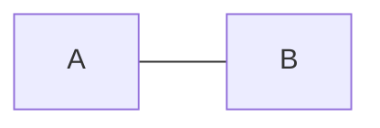

# System Programming 2 - assignment 1

In this assignment, we will implement some graph algorithms using C++.


we have two main classes in this assignment:
* Graph
* Algorithms

we will explain each class in the following sections.

One of the assignment goals is to use `namespace` in the code, so we will use the `shayg` namespace for wrapping the classes and functions in this assignment.


## Graph
This is a class that represents a graph. The graph can be directed or undirected, weighted or unweighted and with positive or negative weights.

All the graph don't have self-loops and multiple edges.

To Represent the graph, we will use an adjacency matrix.


each graph object saves the following properties:
* isDirected : a boolean that represents if the graph is directed or not.

To initialize a `Graph` object, you need to pass if the graph is directed or not. (default is undirected)
```cpp
Graph g(true);  // directed graph

Graph g(false); // undirected graph
Graph g;        // undirected graph
```

### Functions

#### loadGraph

This function will initialize the graph with the given adjacency matrix.

it will check for valid input, and initialize the graph properties.

if the input is invalid, the function will throw an `invalid_argument` exception.

#### printGraph
print information about the graph,in the following format: `Directed/Undirected graph with |V| vertices and |E| edges.`
where $|V|$ is the number of vertices in the graph, and $|E|$ is the number of edges in the graph.

> Note: This graph, contains one edge and 2 vertices.


## Algorithms
This class have only static functions that perform some algorithms on the graph.

### isConnected

In this function, we will use the DFS algorithm to check if the graph is connected or not.

to check if undirected graph is connected, we can perform DFS on the graph and check if all the vertices are discovered.

The way to check if a directed graph is connected is transformed DFS twice:
1. Perform DFS on the graph.
2. If the DFS discovers all the vertices, then the graph is connected. (if we got only one DFS tree)
3. Perform DFS on the root of the last DFS tree.
4. If the DFS discovers all the vertices, then the graph is connected. otherwise, the graph is not connected.

### shortestPath

In this function, we will use the one of 3 algorithms to find the shortest path between two vertices in a graph.

* if the graph is unweighted, we will use the BFS algorithm to find the shortest path between two vertices.
* if the graph is weighted and the weights are negative, we will use the Bellman-Ford algorithm to find the shortest path between two vertices.

> Note: the Bellman-Ford algorithm **DON'T** work with undirected graphs with negative weights.

If there is no path between the two vertices, the function will return "-1".


### isContainsCycle
In this function we check if the graph contains a cycle or not. If the graph contains a cycle, the function will return one of the cycles in this format: `v1->v2->v3->...->v1`. otherwise, the function will return "-1".

#### helper function
for this function, we will use two helper functions:
1. `isContainsCycleUtil`: this function is slightly modified version of the DFS algorithm. it runs until it finds a back edge in the graph, when it finds a back edge, it will call the `constructCyclePath` function to construct the cycle path.

#### cycle in undirected graph

In an undirected graph, a cycle needs at least 3 vertices. so the next graph **DON'T** contain a cycle.


### isBipartite
In this function, we will use the BFS algorithm to check if the graph is bipartite or not. A graph is bipartite iff it is 2-colorable. so we can use the BFS algorithm to check if the graph is bipartite or not.

For directed graphs, we need to convert the directed graph to an undirected graph, because we don't care about the direction of the edges in this function (and the weights).

If the graph is bipartite, the function will return any to sets of vertices that represent a bipartite graph. otherwise, the function will return  `"The graph is not bipartite"`.

The returned format will be: `"The graph is bipartite: A={...}, B={...}"`

### negativeCycle

This function will use the Bellman-Ford algorithm to check if the graph contains a negative cycle or not. If the graph contains a negative cycle, the function will return one of the negative cycles in this format: `v1->v2->v3->...->v1`. otherwise, the function will return `"No negative cycle"`

The way we can find a negative cycle in the graph is to add new vertex `s` and connect it with all the vertices in the graph with weight 0, and for each $uv \notin E$ we will define $w(uv) = \infty$. then we will run the Bellman-Ford algorithm on the graph with the new vertex `s`. if the Bellman-Ford algorithm finds a negative cycle, then the graph contains a negative cycle.

> Note: the Bellman-Ford algorithm **DON'T** work with undirected graphs with negative weights.


# System Programming 2 - Assignment 1

For this assignment, we'll be implementing various graph algorithms in C++. The assignment revolves around two main classes: `Graph` and `Algorithms`. The implementation will utilize namespaces, with the `ariel` namespace wrapping around the classes and functions.

## Graph

The `Graph` class represents a graph, which can be directed or undirected, and can have positive or negative weights.  The graph is represented using an adjacency matrix.

### Functions:

#### loadGraph

This function initializes the graph with the given adjacency matrix. It performs validity checks on the input and sets the graph properties accordingly. If the input is invalid, the function throws an `invalid_argument` exception.

#### printGraph

This function prints information about the graph in the format: "Graph with |V| vertices and |E| edges." Here, |V| represents the number of vertices in the graph, and |E| represents the number of edges.
 """
In addition, I also wrote get functions that will give me access to the fields
 """

## Algorithms

The `Algorithms` class contains static functions that implement various graph algorithms.

### isConnected

This function checks if the graph is connected:
1. Perform DFS on the entire graph.
2. If all vertices are discovered, the graph is connected.

### shortestPath

This function finds the shortest path between two vertices in the graph. It uses one of three algorithms based on the type of graph and weights:
- If the graph is unweighted, it uses Breadth-First Search (BFS).
- If the graph has negative weights, it uses the Bellman-Ford algorithm.

If there is no path between the two vertices, the function returns "-1".

### isContainsCycle

This function checks if the graph contains a cycle. If a cycle exists, the function returns one of the cycles in the format: `v1->v2->v3->...->v1`. If no cycle exists, it returns "-1".

#### Helper Function
- `isContainsCycleUtil`: This is a modified version of DFS that runs until it finds a back edge in the graph. When it finds a back edge, it constructs the cycle path.

### isBipartite

This function checks if the graph is bipartite using BFS. For directed graphs, it converts them to undirected graphs since the direction of edges doesn't matter for this function. If the graph is bipartite, it returns two sets of vertices. Otherwise, it returns "The graph is not bipartite".

### negativeCycle

This function checks if the graph contains a negative cycle using the Bellman-Ford algorithm. If a negative cycle exists, it returns one of the cycles in the format: `v1->v2->v3->...->v1`. Otherwise, it returns "No negative cycle".

The implementation of these algorithms ensures a comprehensive analysis of graph properties and behaviors.
